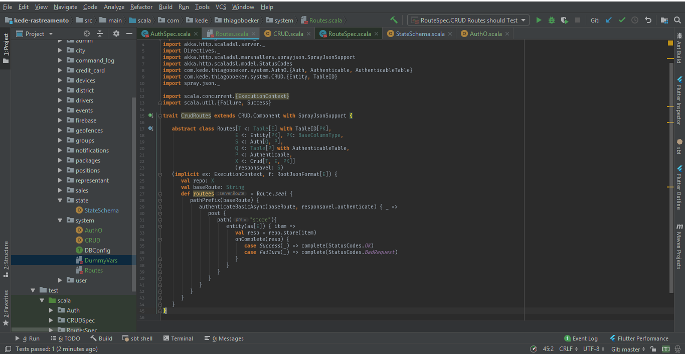
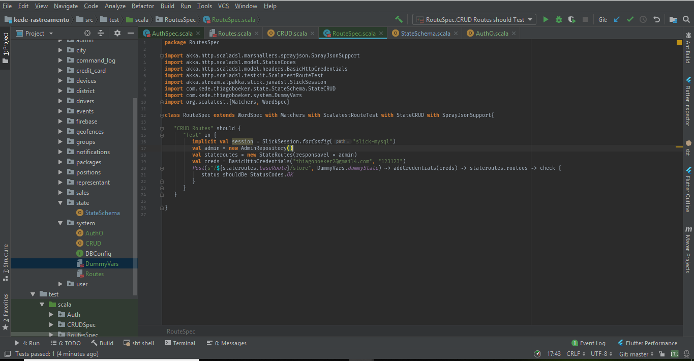

## O B-A-BA

### Funcoes

Funcoes sao uma peça chave para realizar o ato de programar, e qualquer linguagem pode ser avaliada qualitativamente pelo jeito que emprega as funcões em sua estrutura.

Funcoes podem ser:

#### Cidadaos de primeira linha:

Aqui vai um exemplo.

```scala

  // Cria uma funcao
  def double(i: Int) {
    2 * i
  }

  // Assina uma funcao em uma variavel
  val doubler = (i: Int) => 2 * i

  // Retorna uma funcao
  def doubler() {
    (i: Int) => 2 * i
  }

  // Assina uma funcao para uma variavel
  val doublerFunc = doubler()

  // 4
  doublerFunc(2)

  // Recebe uma funcao como parametro
  def operation(operateFunc: (Int) => Int, item: Int) {
    operateFunc(item)
  }

  // 4
  operation(doubler(), 2)
```

**First Class Functions** significa basicamente que voce pode manipular funcoes livremente, voce pode por exemplo:

- Atribuir a uma variavel
- Retornar de uma outra funcao
- Passar como parametro

#### Puras

Funcoes puras sao a melhor coisa do mundo, pena que quase nunca temos a chance de escreve-las.
Uma funcao pura significa que para f(x) => y, y sera invariavel para o respectivo valor de x.
Isso basicamente diz que para um mesmo parametro voce tera sempre o mesmo resultado. Podemos dizer que funcoes puras nao geram **efeitos colaterais**.

#### Impuras
As funcoes impuras por exemplo geram efeitos colaterais. Voce pode pensar como efeito colateral qualquer operacao que altere permanentemente o estado de determinado recurso. Mais comum pensar em operacoes de banco de dados por exemplo.

#### Aridade e leitura

Voce sabe o que é a aridade de uma funçao?

```go
  // Explique o que essa funcao possivelmente realiza
  func (c * Controller) create(w http.ResponseWriter, r * http.Request) {
    Model.create(r.body)
    /*** impl ***/
  }
```

O nome é bem auto-explicativo e os parametros tambem, entao tudo fica muito facil, mas e quando nao for?

```javascript
  // Explica essa daqui
  function do(w, r) {
    M.create(r.body)
    /*** impl ***/
  }
```

Vamos melhorar.

```javascript
  const do = ({responseWriter, request}) => {
    Model.create(request.body)
  }
```

Melhorou? O numero de argumentos de uma funcao é o que chamamos de **aridade**. É muito importante em linguagens funcionas que classificam suas funcoes por sua aridade. No geral devemos sempre manter nossas funcoes bem explicitas sobre o que elas esperam e o que elas retornam, para nao confundir quem ira usa-las posteriormente. Isso tambem é muito importante para leitura e entedimento de **documentação**.

#### Composição

Composição é uma propriedade muito importante das funcoes, é basicamente voce passar o resultado de uma funcao diretamente para outra, criado uma **cadeia** de execução. O ideal é que esse **pipeline** seja tao bem composto que para altera-lo basta voce inserir mais chamadas nele sem alterar a sua estrutura. Quando voce faz isso o seu codigo fica muito mais organizado.

```elixir
  # Retorna `{:ok, user_param}` para usuario aceito.
  # Retorna `{:error, user_param}` para qualquer erro.
  def check_receita(user_param), do: Receita.check_user(user_param)


  # Retorna `{:ok, user}` para usuario criado com sucesso.
  def create_user({:ok, user_param}), do: Model.create(user_param)
  def create_user({:error, user_param} = error), do: error
```

Instanciando o nosso serviço de cadastro.

```elixir
  user_param
  |> check_receita()
  |> create_user()
```

O operador **|>** basicamente passa o que esta ao lado esquerdo como primeiro parametro para a funcao ao lado direito. Entao user_param é passado para check_receita e logo depois o resultado da operaçao é passado para create_user.

Muito bem, mas agora precisamos adicionar uma checagem de cpf. E agora?

```elixir
  {:ok, user_receita_ok} = check_receita(user_param)

  user_cpf_ok = check_cpf(user_receita_ok)

  user = create_user(user_cpf_ok)
```

Nao, nao e nao!
Precisamos montar a nossa funcionalidade de checar cpf no mesmo scopo do nosso pipeline, ela precisa se adequar a estrutura que ja esta implementada.

```elixir
  # Retorna `{:ok, user_param}` para usuario aceito.
  # Retorna `{:error, user_param}` para qualquer erro.
  def check_receita(user_param), do: Receita.check_user(user_param)

  # Retorna `{:ok, user_param}` para usuario ok.
  # Retorna `{:error, user_param}` para usuario com nome sujo.
  def check_cpf({:ok, user_param}), do: CPF.check(user_param)
  def check_cpf({:error, _reason} = error), do: error

  # Retorna `{:ok, user}` para usuario criado com sucesso.
  def create_user({:ok, user_param}), do: Model.create(user_param)
  def create_user({:error, user_param} = error), do: error
```

Agora observem que coisa linda!

```elixir
  user_param
  |> Model.check_receita()
  |> Model.check_cpf()
  |> Model.create_user()
```

E isso valera para qualquer operaçao que precisarmos adicionar posteriormente, dessa forma mantendo o codigo consistente. Apenas adicionando mais funcionalidades a chance de quebrarmos o nosso código diminui.

#### Funcoes Anonimas

Funcoes anonimas sao funcoes nao nomeadas que estao presente na forma de variaveis.

```javascript
  const operation = (func, number) => {
    func(number)
  }
```

A funcao operation recebe uma funcao:

```
  operation((i) => 2 * i, 2)
```

O primeiro parametro dessa chamada é uma **funcao anonima**.
Funcoes anonimas sao muito uteis para organizar o codigo e tambem nao **poluir** o scopo do script com funcoes que serao chamadas apenas em um lugar especifico. Colocar esse tipo de funcao muito especifica no scopo principal do seu codigo pode polui-lo, entao o recomendavel é criar uma funcao anonima dentro do scopo que ela sera empregada.

#### Recursao

Recursao é como tudo funciona, voce apenas nao ve!
Recursao é o ato de chamar uma funcão dentro dela mesmo.

```elixir
  def factorial(n), do: factorial(n - 1, n)

  def factorial(1, acc), do: acc

  def factorial(n, acc) do
    factorial(n - 1, n * acc)
  end
```

Recursao tambem diz respeito a loop. Mas existem apenas uns detalhes, **stacks** e **tail recursion**

```elixir
  def double_all(n) do
    2 * double_all(n - 1)
  end

  # 4?
  double_all(2)
```

O codigo acima representa a cena de um crime e voce deveria ser preso!
O fato de voce ter uma chamada recursiva em uma funcao e ainda precisar de seu retorno no bloco de baixo da pilha, nao é nem um pouco otimizado e deixa o seu codigo mais lento, sem contar que voce corre o risco de **Stack Overflow**. Em sua grande maioria, compiladores/interpretadores estao preparados para otimizarem tail recursion.

Para funcoes isso é tudo por enquanto!

## Orientacao a Objeto

Orientacao a Objeto é o paradigma predominante em programacao, entao vamos falar dos seus conceitos principais.

### Classes

Classe é a estrutura de dados que nos possibilita trazer o dominio do problema da vida real pro nosso codigo.

```javascript
  class Retangulo {
    constructor(altura, largura) {
      this.altura = altura;
      this.largura = largura;
    }
  }
```

### Rabbit hole

Voces conseguem me explicar o que eu fiz aqui?



O resulado foi esse aqui



Valeu a pena?

Orientacao a Objeto como tudo em programacao pode ser um tiro no pé.

#### Acomplamento e Coesao

```javascript
  class FormaGeometrica {
    constructor(vertices) {
      this.vertices = vertices
    }

    calculate_2D_altura() {
      // impl
    }

    calculate_2D_largura() {
      // impl
    }
  }

  class Formas2D extends FormaGeometrica {
    altura() {
      super.calculate_2D_altura()
    }

    largura() {
      super.calculate_2D_largura()
    }
  }

  class Retangulo extends Formas2D {
    constructor(vertices) {
      this.altura = super.altura()
      this.largura = super.largura()
    }
  }
```

O codigo acima parece OK, porem vamos pensar um pouco.. **Se mudarmos algo na implementacao de FormaGeometrica, isso interefere em Formas2D ou em Retangulo?**

Entao agora temos que ter muito cuidado quando alterarmos FormasGeometricas, e mais cuidado ainda se descermos mais ainda na hierarquia. Isso se chama **Acomplamento** e é algo bastante perigoso.

Falando agora de coesão.
Coesão se da atraves da definiçao da responsabilidade de determinada funcao/classe, geralmente atribuimos responsabilidade a efeitos colaterais. Quando a funcao realiza mais de uma tarefa em sua chamada, significa que ela tem baixa coesão e deveriamos desmembra-la em mais de uma para isolar-mos melhor os efeitos colaterais causados.

Entao o ideal é, **baixo acoplamento com alta coesão**.

### Interfaces

Interface voce pode pensar como **Herança de tipos**. Veja no exemplo:

```go
  type Pato interface {
    TemAsa() bool
    AndaComoPato() bool
    FazQuack() bool
  }

  type Patinho struct {
    Nome string
  }

  func (p * Patinho) TemAsa() bool {
    return true
  }

  func (p * Patinho) AndaComoPato() bool {
    return true
  }

  func (p * Patinho) FazQuack() bool {
    return true
  }

  func QuackQuack(p * pato) {
    if(p.AndaComoPato() && p.FazQuack() && p.TemAsa()) {
      fmt.Println("Quack Quack")
    } else {
      fmt.Println("Nao sou um pato")
    }
  }

  func main() {
    patito := Patinho{Nome: "Feio"}
    QuackQuack(&patito)
  }
```

Quando falamos de interface podemos pensar em um modelo de **contratos**. Entao a interface _*pato*_ requisita que para assinar o seu contrato e herdar o seu tipo, a estrutura precisa implementar suas tres funcoes. Ocorrendo as implementacoes a estrutura herda o tipo _pato_. No caso acima _Patinho_ implementa as tres funcoes entao agora _Patinho_ tambem pode ser considerada um _pato_. Entao qualquer funcao que requisite um pato como parametro, poderemos passar _Patinho_. Agora imagine que tivessemos a classe _Cisne_ que tivesse:

```go
  type Cisne struct {
    Nome string
  }

  func (c * Cisne) TemAsa() bool {
    return true
  }

  func (c * Cisne) AndaComoPato() bool {
    return true
  }

  func (c * Cisne) FazQuack() bool {
    // Cisne nao faz Quack
    return false
  }
```

**Cisne é um pato? Qual o retorno de QuackQuack()?**

#### Poliformismo

Poliformismo é quando uma funcao da classe herdada tem diferentes implementaçoes nas classes que estao herdando. Nao vamos adentrar muito em poliformismo por agora.


## Orientacao a Objeto x Behaviour

Se eu disser pra voces esquecerem OOP e focar em **Behaviour**, voces topam?

Behaviour é uma maneira incrivel de abstrair o dominio do problema pro seu codigo. Quando falar em Behaviour voce pode pensar em **Interfaces** que vimos anteriormente, o conceito é praticamente o mesmo, voce define o que aquele recurso precisa implementar para afirmar que aquele recurso tem o **comportamento** definido pelo Behaviour.

```elixir
defmodule Maquina do
  @callback ligar(term) :: {:ok, term} | {:error, String.t}
  @callback desligar(term) :: {:ok, term} | {:error, String.t}
  @callback duration() :: Integer.t
end
```

No exemplo acima definimos o Behaviour _*Maquina*_, e dissemos que para um recurso/modulo ser considerado uma Maquina em nosso sistema, ele precisa obrigatoriamente implementar esses 3 metodos, gerando até mesmo um erro de compilacao caso contrario.

Ao adotar o Behaviour como carro chefe para abstracoes de processos, nós por natureza ganhamos acesso a outro conceito muito poderoso. As FSM's

## FSM's - Finite State Machines

FSM's ou Maquina de Estados Finitos nos ajudam a modelar comportamento de maneira a preservar um estado consistente. No caso de _*Maquina*_ acima, temos duas acoes que possivelmente vao alterar o estado da maquina, ligar e desligar. Chamaremos esses estados de _*ON*_ e _*OFF*_, **entao para o estado de _*OFF*_ como a nossa maquina deve responder a uma mensagem de acionamento? E caso ja esteja ligada?**
Entao perceba que o comportamento/resposta da nossa maquina se dara atraves da mensagem que ela receber em conjunto com o seu estado atual naquele determinado ponto no tempo. Mas percebam tambem que o caso das FSM's pede implicitamente um ambiente com garantias de **thread safety**.

## Demonstracao de uma FSM


## Desafio da Lavadora

#### Requisitos basicos

- Definir 2 estados: ON e OFF
- Apos algum comando inconsistente (Comando Ligar com estado ON) deve-se retornar uma mensagem de erro para o cliente
- Garantir **thread safety**.
- Apos decorrido o tempo definido em Duraion/0, a maquina deve atualizar o seu estado para _*OFF*_.

#### Requisitos da Interface

- Ligar(opts) :: Comando de ligar
- Desligar(opts) :: Comando de desligar
- Duration :: Duracao da lavagem
